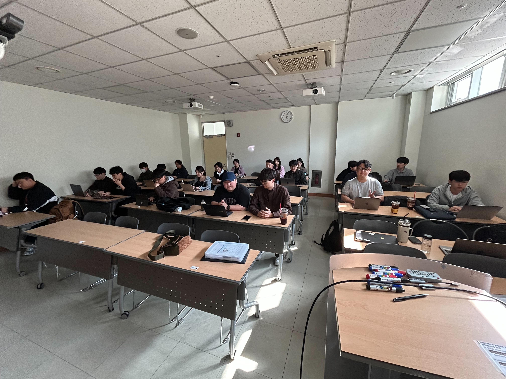
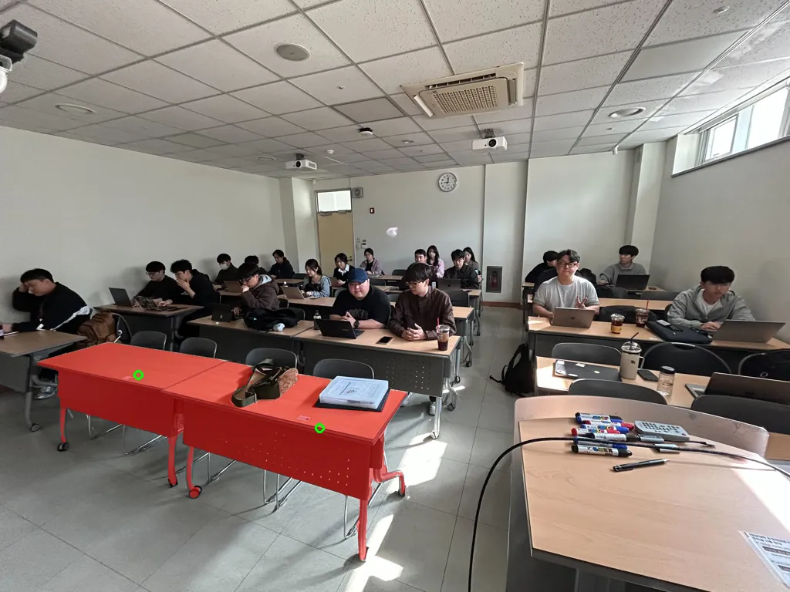
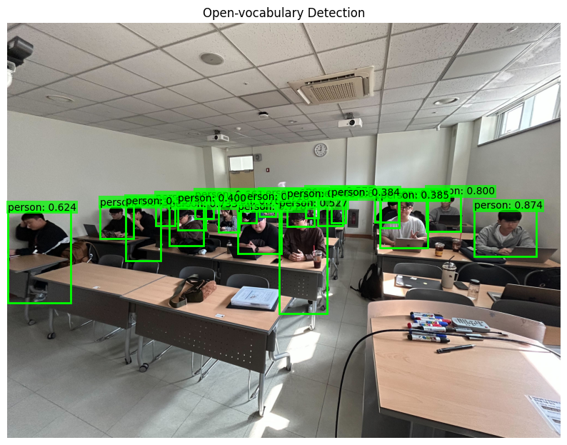
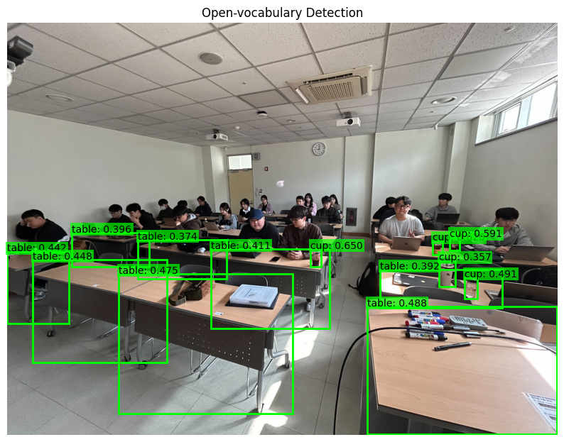

# XAI506 DeepLearning Project

- EfficientSAM 세그멘테이션
- Grounding DINO Open-vocabulary Detection
- LLaVA VQA
- Segmentation + SD3 Inpainting

---

## 1. Set Up

### Requirements

- Python 3.10+ , `pip`
- NVIDIA GPU + CUDA
> (선택) Cloudflare Pages 배포 시 `node`, `npm`, `wrangler`


### Git clone

```bash
git clone https://github.com/HahnGyuTak/DL-project.git
cd DL-project
```

### Python Environment

#### `venv` 

```bash
python -m venv .venv
source .venv/bin/activate
pip install --upgrade pip
pip install -r requirements_api.txt
```

#### `conda` 

```bash
conda create -n dl-project python=3.10 -y
conda activate dl-project
pip install --upgrade pip
pip install -r requirements_api.txt
```

---

## 2. ipynb 코드 I/O

### 2.1 Input image




### 2.2 Efficient SAM 

[code](ipynb/efficientsam_segmentation.ipynb)




### 2.3 Open vocab detection

[code](ipynb/grounding_dino_open_vocab_detection.ipynb)

`candidate_labels = ['person']`



`candidate_labels = ['table', 'cup']`




### 2.4 LLava VQA

[code](ipynb/llava_vqa_xai506_example.ipynb)

`question = 'What is happening in this image? Please answer in Korean.'`


```
Model: llava-hf/llava-1.5-7b-hf
Device: cuda
DType: float16
--- Question ---
What is happening in this image? Please answer in Korean.
--- Answer ---
이 이미지에서는 학생들이 학교에서 수업을 듣고 있는 모습을 볼 수 있습니다. 학생들은 컴퓨터와 라피를 사용하며, 책과 커피잔을 볼 수 있습니다. 이 모습은 학생들이 집중하고 있는 학습 환경을 보여줍니다.
```