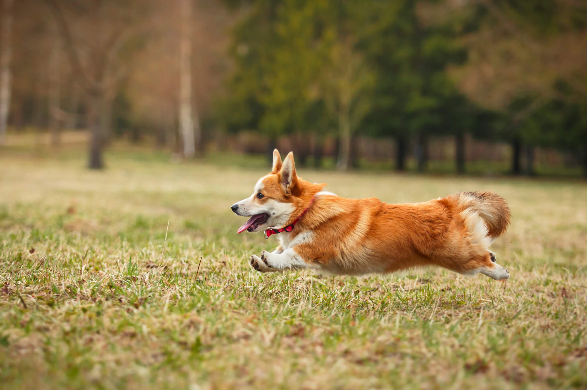

# MLLM Image Edit

이미지와 자연어 요청으로 특정 객체를 찾고, mask 기반으로 수정하는 대화형 이미지 편집 프로젝트다.

학생 제출용 메인 시연 코드는 루트의 [`demo.py`](demo.py)다. GitHub 저장소 링크와 함께 `demo.py`를 실행하면 Gradio 기반 데모를 바로 확인할 수 있다.

## Web Demo

Cloudflare Pages에 배포된 MLLM Image Edit Chatbot UI는 [https://model-dock.pages.dev](https://model-dock.pages.dev)에서 확인할 수 있다. 모델 추론은 GPU FastAPI 서버에서 수행하므로, 페이지 상단의 API URL에 실행 중인 서버 주소를 설정해야 한다.

## 1. Installation Guide

### Requirements

- Python 3.10 이상
- NVIDIA GPU 및 CUDA 지원 PyTorch 환경 권장
- 충분한 GPU 메모리와 Hugging Face 모델 캐시 저장 공간
- `git`

SD3 base model은 Hugging Face 모델 카드에서 접근 승인이 필요할 수 있다. 처음 실행 전에 해당 모델 접근 권한을 승인하고 Hugging Face에 로그인한다.

```bash
hf auth login
```

### Clone Repository

```bash
git clone https://github.com/HahnGyuTak/DL-project.git
cd DL-project
```

### Create Python Environment

`venv` 또는 `conda` 중 하나를 사용한다.

#### venv

```bash
python -m venv .venv
source .venv/bin/activate
pip install --upgrade pip
pip install -r requirements.txt
```

#### conda

```bash
conda create -n mllm-image-edit python=3.10 -y
conda activate mllm-image-edit
pip install --upgrade pip
pip install -r requirements.txt
```

### Run Main Demonstration

```bash
python demo.py
```

시작 시 EfficientSAM, Grounding DINO, Qwen2.5-VL, SD3 Inpaint를 GPU에 preload한다. 모델 다운로드와 로딩이 끝나면 터미널에 Gradio 주소가 출력된다.

```text
* Running on local URL: http://0.0.0.0:7860
```

로컬 브라우저에서는 `http://127.0.0.1:7860`을 연다. 원격 서버에서는 서버 IP와 포트를 사용한다.

포트를 고정하거나 외부 접속을 허용하려면 다음과 같이 실행한다.

```bash
GRADIO_SERVER_NAME=0.0.0.0 GRADIO_SERVER_PORT=7860 python demo.py
```

### Example Input Image

아래 예시 이미지는 저장소의 `img/test.jpg`다. 데모에서 이 이미지를 업로드한 뒤, `호랑이를 수정하고 싶어`와 `고양이로 수정해줘`를 순서대로 입력해 대화형 편집 흐름을 확인할 수 있다.



1. `demo.py` 화면에서 이미지를 업로드한다.
2. `호랑이를 수정하고 싶어`처럼 수정 대상을 입력한다.
3. overlay와 mask를 확인한 뒤 `고양이로 수정해줘`처럼 변경 내용을 입력한다.
4. 제안된 SD3 prompt를 확인하고 `수정 진행`을 눌러 결과를 생성한다.

## 2. MLLM Image Edit

### Purpose

사용자는 이미지를 업로드한 뒤 자연어로 수정할 객체와 수정 내용을 대화한다. 예를 들어 `강아지를 수정하고 싶어`라고 입력해 대상을 선택하고, `고양이로 수정해줘`라고 입력해 변경 내용을 제안받은 뒤 승인하면 결과 이미지를 생성한다.

### Pipeline

1. **Qwen2.5-VL**이 사용자의 한국어 요청을 객체 라벨과 영어 편집 의도로 해석한다.
2. **Grounding DINO**가 텍스트 라벨에 맞는 객체 bounding box를 찾는다.
3. **EfficientSAM**이 bounding box를 입력받아 정밀 segmentation mask를 생성한다.
4. **Qwen2.5-VL**이 수정 요청을 SD3용 영어 inpainting prompt로 정리한다. 요청한 객체와 색상 등이 누락되거나 충돌하는 후보 프롬프트는 사용하지 않는다.
5. **Stable Diffusion 3 Inpaint**가 원본 이미지, 확장된 mask, 승인된 prompt를 입력받아 mask 내부만 수정한다.

mask는 SD3 경계가 자연스럽게 이어지도록 1024px 기준 12px까지 확장한다. 수정 결과가 생성된 뒤에도 같은 대화 세션에서 추가 편집을 반복할 수 있다.

### Input and Output

| Stage | Input | Output |
| --- | --- | --- |
| Target selection | Image + `강아지를 수정하고 싶어` | Detection box, segmentation overlay, mask |
| Edit proposal | `고양이로 수정해줘` | SD3 inpainting prompt + approval request |
| Image generation | `수정 진행` 버튼 | Edited image with the selected mask region changed |

### Main Code Structure

- [`demo.py`](demo.py): 메인 Gradio demonstration entry point
- [`code/gradio_ui.py`](code/gradio_ui.py): 이미지 업로드, 채팅, 승인 버튼 UI
- [`code/edit_chat.py`](code/edit_chat.py): 공통 대화 상태머신과 SD3 prompt 생성
- [`code/intent_parser.py`](code/intent_parser.py): Qwen 응답에서 대상·편집 의도 추출
- [`code/model_runtime.py`](code/model_runtime.py): EfficientSAM, Grounding DINO, Qwen2.5-VL, SD3 모델 로드 및 추론

### Models and Loading Behavior

`demo.py`는 시작 시 네 모델을 preload한다. 로컬 모델이란 명시적인 로컬 checkpoint 경로 또는 Hugging Face cache에 이미 저장된 파일을 뜻한다.

| Model | Local checkpoint/cache exists | Local checkpoint/cache does not exist |
| --- | --- | --- |
| EfficientSAM | Hugging Face cache의 GPU JIT checkpoint를 바로 읽는다. | `merve/EfficientSAM`에서 `efficient_sam_s_gpu.jit`를 내려받는다. GPU checkpoint를 사용할 수 없으면 CPU checkpoint를 사용한다. |
| Grounding DINO | Hugging Face cache에 저장된 processor와 weight를 사용한다. | `IDEA-Research/grounding-dino-tiny`의 processor와 weight를 자동으로 내려받는다. |
| Qwen2.5-VL | 기본 경로 `/mnt/data1/models/qwen/Qwen2.5-VL-7B-Instruct`가 있으면 해당 로컬 checkpoint만 사용한다. `QWEN_VL_MODEL_ID`로 다른 로컬 경로도 지정할 수 있다. | 로컬 경로가 없으면 `Qwen/Qwen2.5-VL-7B-Instruct`를 Hugging Face에서 내려받는다. |
| SD3 Inpaint | Hugging Face cache의 inpainting pipeline 파일과 SD3 base model weight를 사용한다. | `IrohXu/stable-diffusion-3-inpainting` pipeline 파일과 `stabilityai/stable-diffusion-3-medium-diffusers` base model을 내려받는다. 모델 접근 권한이 필요할 수 있다. |

모델 cache 위치를 별도 디스크로 지정하려면 실행 전에 `HF_HOME`을 설정한다.

```bash
export HF_HOME=/path/to/huggingface-cache
python demo.py
```

### Model Sources

- Segmentation: [`merve/EfficientSAM`](https://huggingface.co/merve/EfficientSAM)
- Open-vocabulary detection: [`IDEA-Research/grounding-dino-tiny`](https://huggingface.co/IDEA-Research/grounding-dino-tiny)
- MLLM: [`Qwen/Qwen2.5-VL-7B-Instruct`](https://huggingface.co/Qwen/Qwen2.5-VL-7B-Instruct)
- Image editing: [`IrohXu/stable-diffusion-3-inpainting`](https://huggingface.co/IrohXu/stable-diffusion-3-inpainting) pipeline with [`stabilityai/stable-diffusion-3-medium-diffusers`](https://huggingface.co/stabilityai/stable-diffusion-3-medium-diffusers)
